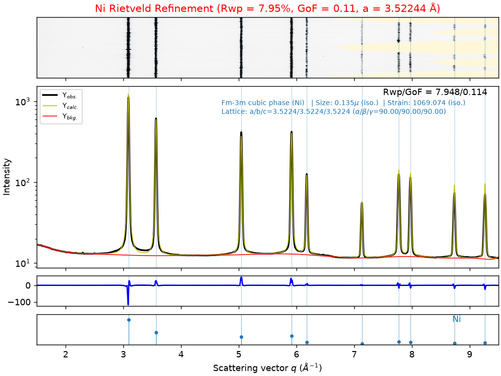

# Walkthrough: 2D XRD Integration & Rietveld Refinement of Nickel (Ni)

We processed the high-energy 2D XRD detector dataset of metallic Nickel (**Ni**), performed azimuthal integration with `pyFAI`, applied calibrated instrumental parameters from GSAS-II, and executed a multi-stage Rietveld refinement using `easyXRD`. The complete workflow was documented and executed in a Jupyter Notebook.

## 1. 2D Azimuthal Integration (`pyFAI`)

- **Detector Data**: Loaded [Ni.tiff](Ni.tiff) ($3888 \times 3072$ pixels) using `fabio` and `easyxrd`.
- **Geometry & Calibration**: Applied [_calibration.poni](_calibration.poni) (Dexela2923 detector, sample-to-detector distance $\approx 0.599\text{ m}$, beam center, and $\lambda = 0.01799\text{ nm} = 0.1799\text{ \AA}$).
- **Detector Mask**: Applied [_mask.edf](_mask.edf) to remove dead pixels, detector gaps, and the beamstop shadow.
- **Radial Range**: Restricted to $q \in [1.5, 9.5]\text{ \AA}^{-1}$ to eliminate direct beam scatter and noisy edge pixels.
- **Exported 1D Profile**: Saved the integrated 1D powder pattern $I(q)$ vs $q$ as [Ni_1D.xy](Ni_1D.xy).

## 2. Decoupled Instrumental Profile

- Calibrated instrumental broadening parameters ($U, V, W, \text{Zero}$) were read directly from [_instrument_parameters.gpx](_instrument_parameters.gpx).
- Instrumental profile parameters remained fixed during refinement so that sample broadening accurately represents physical crystallite domain size and microstrain.

## 3. Progressive Rietveld Refinement Progression

Following the protocol from `easyXRD_examples`, the refinement escalated smoothly across stages:

| Stage | Refined Parameters | Initial $R_{wp}$ (%) | Refined $R_{wp}$ (%) | Refined GoF ($\chi^2$) | Relative $\Delta R_{wp}$ |
| :--- | :--- | :---: | :---: | :---: | :---: |
| **0. Initial Le Bail** | Baseline profile fit | — | 26.019% | 0.374 | Baseline |
| **1. Background (5 terms)** | 5-term Chebyshev polynomial | 26.019% | 21.874% | 0.315 | -15.93% |
| **2. Cell Parameter** | Cubic lattice parameter $a$ | 21.874% | 13.924% | 0.200 | -36.34% |
| **3. Background (10 terms)** | 10-term Chebyshev polynomial | 13.924% | 13.487% | 0.194 | -3.14% |
| **4. Peak Broadening** | Isotropic crystallite size ($Y$) & strain | 13.487% | 9.614% | 0.138 | -28.72% |
| **5. Rietveld Transition** | `set_LeBail(to=False)` | 9.614% | 17.202% | 0.247 | +78.92% (Structural) |
| **6. Thermal Parameter** | Atomic displacement $U_{iso}$ on Ni site | 17.202% | 11.045% | 0.159 | -35.79% |
| **7. Background (15 terms)** | 15-term Chebyshev polynomial | 11.045% | 10.234% | 0.147 | -7.34% |
| **8. Final Cell Parameter** | Lattice parameter simultaneous fit | 10.234% | **7.948%** | **0.114** | **-22.34%** |

## 4. Final Refined Crystallographic Properties

| Property | Initial / Literature Value | Refined Value |
| :--- | :--- | :--- |
| **Space Group** | $Fm\bar{3}m$ (No. 225) | $Fm\bar{3}m$ (No. 225) |
| **Lattice Parameter ($a$)** | $3.52558\text{ \AA}$ (initial CIF) / $3.5238\text{ \AA}$ (NIST room temp) | **$3.52244\text{ \AA}$** |
| **Unit Cell Volume ($V$)** | $43.822\text{ \AA}^3$ | **$43.705\text{ \AA}^3$** |
| **Calculated Density ($\rho$)** | $8.896\text{ g/cm}^3$ | **$8.920\text{ g/cm}^3$** |
| **Weighted Profile Residual ($R_{wp}$)** | — | **$7.948\%$** |
| **Goodness of Fit (GoF / $\chi^2$)** | — | **$0.114$** |
| **Convergence** | — | **True** |

## 5. Refinement Plot

The upper panel shows the 2D azimuthal cake intensity map, and the lower panel shows the experimental powder pattern ($Y_{obs}$), calculated model ($Y_{calc}$), background ($Y_{bkg}$), difference curve ($Y_{obs} - Y_{calc}$), and theoretical Bragg reflection ticks:

## 6. Generated Output Artifacts

- [Ni_Rietveld_Refinement.ipynb](Ni_Rietveld_Refinement.ipynb): Fully executed Jupyter notebook with all code, markdown notes, inline outputs, and plots.
- [Ni_1D.xy](Ni_1D.xy): Radially integrated 1D ASCII profile data ($q$ vs intensity).
- [Ni_refined.gpx](Ni_refined.gpx): Complete GSAS-II project file containing the refined histograms, phases, and parameters.
- [Ni_refinement_plot.png](Ni_refinement_plot.png): High-resolution refinement plot.
- [token_usage.md](token_usage.md): Detailed token expenditure and multi-turn metrics.
